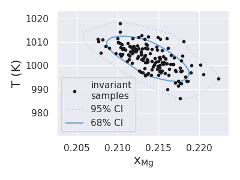

=============================
Invariant Calculation Example
=============================

In the following example, we demonstrate the calculation and plotting
of invariant points with quantified uncertainty.

Set-up
------

First we import all of the required packages, and set the seaborn
color codes so that we have pretty plots later.

.. code-block:: python

    import matplotlib.pyplot as plt
    import numpy as np
    import seaborn as sns
    from dask.distributed import Client
    from distributed.deploy.local import LocalCluster
    from pycalphad import Database, equilibrium, variables as v
    from pduq.invariant_calc import invariant_samples
    from pduq.uq_plot import plot_contour
    sns.set(color_codes=True)

Now we use dask distributed to start up a cluster so we can do our
invariant calculations in parallel. Set `n_workers` to the number
of cores/processes on the cpu or fewer.

.. code-block:: python

    c = LocalCluster(n_workers=8, threads_per_worker=1)
    client = Client(c)
    print(client)

By printing the client we can see that we have the correct number
of workers.

.. parsed-literal::

   <Client: scheduler='tcp://127.0.0.1:56581' processes=8 cores=8>

Now we load the database file, and load the parameter sets into a
numpy array with the following shape:
(# parameter sets, # parameters)

.. code-block:: python

    dbf = Database('CU-MG_param_gen.tdb')
    params = np.load('trace.npy')[:, -1, :]

Invariant Calculations
----------------------

We then set up and run the invariant calculation for all of our
parameter sets using the `invariant_samples` function from the
`invariant_calc` module. We start by defining the important
variables. This includes a guesses for the composition of the
invariant and for the temperature bounds.

.. code-block:: python

    X = .2  # X_MG guess for invariant
    P = 101324  # pressure
    Tl = 600  # lower temperature bound for invariant
    Tu = 1400  # upper temperature bound for invariant
    comp = 'MG'  # species to reference for composition

    Tv, phv, bndv = invariant_samples(
        dbf, params, X, P, Tl, Tu, comp, client=client)

Data Analysis and Plotting
--------------------------

Now that the calculation has completed, let's calculate the mean
composition and temperature of the invariant:

.. code-block:: python

    print('mean invariant composition:', np.mean(bndv[:, 1]))
    print('mean invariant temperature:', np.mean(Tv))

.. parsed-literal::

    mean invariant composition: 0.21396602343616997
    mean invariant temperature: 1003.1419270833334

Let's also plot the invariant points calculated for each parameter
set and some uncertainty contours

.. code-block:: python

    # form an array for the invariant points
    points = np.zeros((len(Tv), 2))
    points[:, 0] = bndv[:, 1]
    points[:, 1] = Tv
    c = sns.color_palette("Blues", 2)

    plt.figure(figsize=(4, 3))

    # plot the raw invariant points
    plt.plot(points[:, 0], points[:, 1], 'k.',
             label="invariant\nsamples")

    # plot KDE estimated uncertainty intervals
    plot_contour(points, c, 0.6)

    plt.xlabel(r'$\mathrm{x_{Mg}}$', fontsize="large")
    plt.ylabel('T (K)', fontsize="large")
    plt.tight_layout()
    plt.legend()
    plt.show()

resulting in the following figure

Finally, we can calculate how many of the total 150 points
fall within some desired composition and temperature domain

.. code-block:: python

    reg = (.212<=points[:, 0])*(points[:, 0]<.217)* \
          (999<=points[:, 1])*(points[:, 1]<1007)
    print('points for .212<=X<.217, 999<=T<1007:', np.sum(reg))

.. parsed-literal::

    points for .212<=X<.217, 999<=T<1007: 51

This means that the invariant has 34% probability of falling in
the defined region
