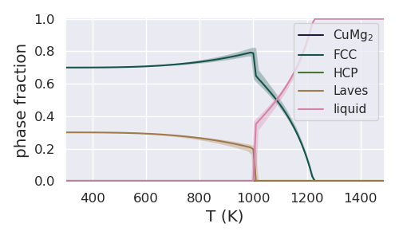
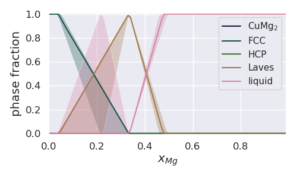

==================================
Phase Fractions at Constant X or T
==================================

In the following example, we demonstrate the simultaneous
calculation of line phase equilibria for multiple
Gibbs energy parameter sets in CALPHAD using PDUQ, followed
by a visualization.

Set-up
------

In this example we will reuse the eq file from the previous
:ref:`example <whole-phase-diagram>` where we performed UQ tasks
on the full Cu-Mg phase diagram.

First, we import the `plot_phasefracline` function from the
`uq_plot` module.

.. code-block:: python

    from pduq.uq_plot import plot_phasefracline

Data Analysis and Plotting
--------------------------

Let us start by plotting the phase fraction as it varies with
temperature with the composition fixed at 0.1 molar fraction Mg.

.. code-block:: python

    # define a dictionary fixing the composition. We need to pick
    # a value for X_MG that is represented in the eq object
    coordD = {'X_MG':0.1}

    # plot the phase fraction versus composition
    # cdict and phase_label_dict are the same as in the previous example
    uq.plot_phasefracline(eq, coordD, xlabel='T (K)', cdict=cdict,
                          phase_label_dict=phase_label_dict, figsize=(5, 3))

resulting in the following figure

Next we plot the phase fraction as it varies with composition at 1000K.

.. code-block:: python

    # define a dictionary fixing the temperature. We need to pick
    # a value for T that is represented in the eq object
    coordD = {'T':1000}

    # plot the phase fraction versus composition
    # cdict and phase_label_dict are the same as in the previous example
    uq.plot_phasefracline(eq, coordD, xlabel=r"$x_{Mg}$", cdict=cdict,
                          phase_label_dict=phase_label_dict, figsize=(5, 3))

resulting in the following figure

