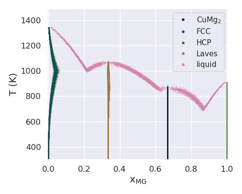
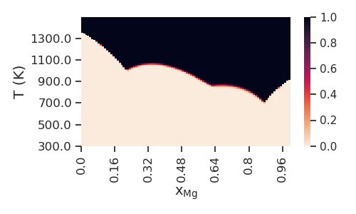

======================================
Phase Diagram Calculation and Analysis
======================================

In the following example, we demonstrate the simultaneous
calculation of phase diagrams for multiple Gibbs energy 
parameter sets in CALPHAD using PDUQ. We then produce a
variety of phase diagram representations with uncertainty.

Set-up
------

First, we import all of the required packages.

.. code-block:: python

    import numpy as np
    import seaborn as sns
    from dask.distributed import Client
    from distributed.deploy.local import LocalCluster
    from pycalphad import Database, variables as v
    from pduq.dbf_calc import eq_calc_samples
    from pduq.uq_plot import plot_phasereg_prob, plot_superimposed

Now we use dask distributed to start up a cluster so we can do our
phase diagram calculations in parallel. Set `n_workers` to the number
of cores/processes on the cpu or fewer.

.. code-block:: python

    c = LocalCluster(n_workers=8, threads_per_worker=1)
    client = Client(c)
    print(client)

By printing the client we can see that we have the correct number
of workers.

.. parsed-literal::

   <Client: scheduler='tcp://127.0.0.1:56581' processes=8 cores=8>

Now we load the database file, and load the parameter sets for the
last iteration of our ESPEI MCMC run into a numpy array with the 
following shape:
(# parameter sets, # parameters)
or
(150, 15)

.. code-block:: python

    dbf = Database('CU-MG_param_gen.tdb')
    params = np.load('trace.npy')[:, -1, :]

.. _whole-phase-diagram:

Equilibrium Calculations
------------------------

We then set up and run the equilibrium calculations for our
150 parameter sets using the `eq_calc_samples` function
from the `dbf_calc` module. We first define the equilibrium
conditions for our single point, and then calculate the
equilibria. Using the current version of pycalphad, calculating
all 150 phase diagrams will take several hours on a desktop
computer. This will be significantly faster in upcoming
releases. You can check the progress in the pduq.log file
that is automatically generated.

.. code-block:: python

    # equlibrium conditions including the pressure (Pa),
    # temperature evaluation points (K), and molar
    # composition MG evaluation points
    conds = {v.P: 101325, v.T: (300, 1500, 10), v.X('MG'): (0, 1, 0.01)}

    # perform the equilibrium calculation
    eq = eq_calc_samples(dbf, conds, params, client=client)

Phase Diagram Uncertainty Visualization
---------------------------------------

Let us first visualize the uncertainty in the phase
boundaries by superimposing the phase diagrams with
uncertainty.

.. code-block:: python

    # We can assign colors to the phase names so
    # that they are the same in all of the plots
    phaseL = list(np.unique(eq.get('Phase').values))
    if '' in phaseL: phaseL.remove('')
    nph = len(phaseL)
    colorL = sns.color_palette("cubehelix", nph+2)
    cdict = {}
    for ii in range(nph):
        cdict[phaseL[ii]] = colorL[ii]

    # we can also specify a dictionary to have pretty
    # labels (even LaTeX) in our plots
    phase_label_dict = {
        'LIQUID':'liquid', 'FCC_A1':'FCC', 'HCP_A3':'HCP',
        'CUMG2':r'$\mathrm{Cu{Mg}_2}$', 'LAVES_C15':'Laves'}

    # plot the superimposed phase diagrams
    uq.plot_superimposed(eq, 'MG', alpha=0.2,
                      xlims=[-.005, 1.005], cdict=cdict,
                      phase_label_dict=phase_label_dict,
                      figsize=(5, 4))

Now we plot the probability of non-zero phase fraction
for the liquid phase over all 150 Gibbs energy parameter
sets versus composition and temperature.

.. code-block:: python

    uq.plot_phasereg_prob(
        eq, ['LIQUID'], coordplt=['X_MG', 'T'], figsize=(5, 3))

