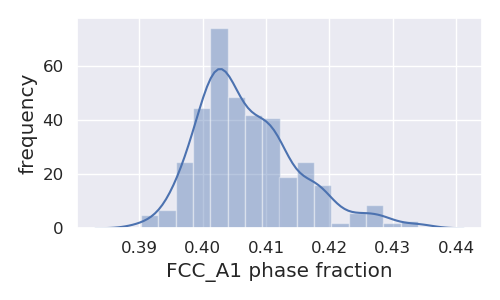
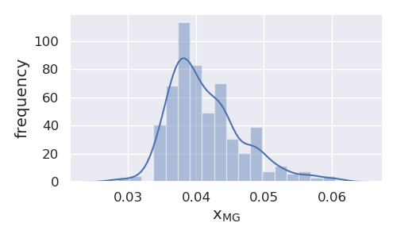

=================================================
Single Point Equilibrium Calculation and Analysis
=================================================

In the following example, we demonstrate the simultaneous
calculation of single point phase equilibria for multiple
Gibbs energy parameter sets in CALPHAD using PDUQ. We
then perform typical analyses on the results.

Set-up
------

First, we import all of the required packages.

.. code-block:: python

    import numpy as np
    from dask.distributed import Client
    from distributed.deploy.local import LocalCluster
    from pycalphad import Database, variables as v
    from pduq.dbf_calc import eq_calc_samples
    from pduq.uq_plot import get_phase_prob, plot_dist

Now we use dask distributed to start up a cluster so we can do our
equilibrium calculations in parallel. Set `n_workers` to the number
of cores/processes on the cpu or fewer.

.. code-block:: python

    c = LocalCluster(n_workers=8, threads_per_worker=1)
    client = Client(c)
    print(client)

By printing the client we can see that we have the correct number
of workers.

.. parsed-literal::

   <Client: scheduler='tcp://127.0.0.1:56581' processes=8 cores=8>

Now we load the database file, and load the parameter sets for the
last 5 converged iterations of our ESPEI MCMC run into a
numpy array with the following shape:
(# parameter sets, # parameters)
or
(750, 15)

.. code-block:: python

    dbf = Database('CU-MG_param_gen.tdb')
    params = np.load('trace.npy')[:, -5:, :].reshape((150*5, 15))

Equilibrium Calculations
------------------------

We then set up and run the equilibrium calculations for our
750 parameter sets using the `eq_calc_samples` function
from the `dbf_calc` module. We first define the equilibrium
conditions for our single point, and then calculate the
equilibria.

.. code-block:: python

    # Define the equilibrium conditions including pressure
    # (Pa), temperature (K), and molar composition Mg
    conds = {v.P: 101325, v.T: 1003, v.X('MG'): 0.214}

    # perform the equilibrium calculation for all parameter
    # sets
    eq = eq_calc_samples(dbf, conds, params, client=client)

Data Analysis and Plotting
--------------------------

Now that the calculation has completed, let's calculate the
probabilities of each phase combination having a non-zero
phase fraction:

.. code-block:: python

    # define a list of phase regions
    phaseregLL = [['FCC_A1', 'LIQUID'], ['LIQUID'],
                  ['LAVES_C15', 'LIQUID'],
                  ['FCC_A1', 'LAVES_C15']]

    # calculate the probability of non-zero phase fraction
    for phaseregL in phaseregLL:
        prob = get_phase_prob(eq, phaseregL)
        print(phaseregL, ' ', np.squeeze(prob.values))

.. parsed-literal::

    ['FCC_A1', 'LIQUID']   0.21066666666666667
    ['LIQUID']   0.23333333333333334
    ['LAVES_C15', 'LIQUID']   0.04133333333333333
    ['FCC_A1', 'LAVES_C15']   0.5146666666666667

From this analysis we have discovered that there is a roughly
51% probability of the FCC_A1 + LAVES_C15 phases having a
non-zero phase fraction.

Let's also plot distributions for the FCC_A1 phase fraction
and composition when there is a non-zero FCC_A1 + LAVES_C15
phase fraction:

.. code-block:: python

    coordD = {'T':1003, 'X_MG':.214, 'component':'MG'}
    phaseregL = ['FCC_A1', 'LAVES_C15']
    phase = 'FCC_A1'    
    
    # plot the phase fraction
    uq.plot_dist(eq, coordD, phaseregL, phase, typ='NP', figsize=(5, 3))

    # plot the phase composition
    uq.plot_dist(eq, coordD, phaseregL, phase, typ='X', figsize=(5, 3))

resulting in the following figures

