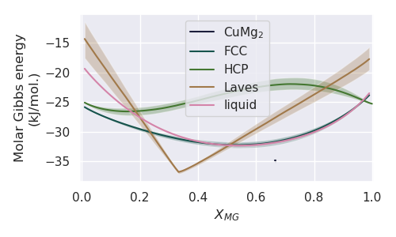
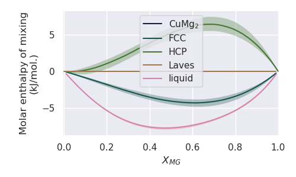

=======================================================
Uncertainty Quantification for Thermodynamic Properties
=======================================================

In the following example, we leverage the multiple parameter
sets resulting from ESPEI to plot thermodynamic properties
(Cp, H, S, and G) with quantified uncertainty.

Set-up
------

First, we import the `plot_property` function from the
`uq_plot` module.

.. code-block:: python

    from pduq.uq_plot import plot_property

Now we load the database file, and load the parameter sets for the
last converged iterations of our ESPEI MCMC run into a
numpy array with the following shape:
(# parameter sets, # parameters)
or
(150, 15)

.. code-block:: python

    dbf = Database('CU-MG_param_gen.tdb')
    params = np.load('trace.npy')[:, -1:, :]

Plotting Molar Gibbs Energy
---------------------------

Let's go ahead and plot the molar Gibbs energy versus molar
composition at a fixed temperature.

.. code-block:: python

    comps = ['MG', 'CU', 'VA']  # species to consider
    T = 650  # temperature in Kelvin
    prop = 'GM'  # property of interest (molar Gibbs energy)
    ylabel = 'Molar Gibbs energy\n(kJ/mol.K)'  # y-axis label
    yscale = 1e-3  # we want to scale the Gibbs energy to give kJ/mol.

    # we can now plot the property. Note that phaseL, phase_label_dict,
    # and cdict are defined in the phase diagram prediction example
    uq.plot_property(dbf, comps, phaseL, params, T, prop,
                     phase_label_dict=phase_label_dict,
                     ylabel=ylabel, yscale=yscale, cdict=cdict,
                     xlim=[-0.005, 1.005], figsize=(5, 3))

PDUQ will provide the following output during plotting,

.. parsed-literal::

    starting GM evaluations for the CUMG2 phase
    phase is a line compound
    starting GM evaluations for the FCC_A1 phase
    starting GM evaluations for the HCP_A3 phase
    starting GM evaluations for the LAVES_C15 phase
    starting GM evaluations for the LIQUID phase

telling us when the evaluation of the energies of each phase
has begin and that the CUMG2 phase is being treated as a line
compound.

Finally, PDUQ will produce the following figure.

Plotting Molar Enthalpy of Mixing
------------------------------------

Let's go ahead and plot the molar enthalpy of mixing versus molar
composition at a fixed temperature.

.. code-block:: python

    T = 298.15  # temperature in Kelvin
    prop = 'HM_MIX'  # property of interest (molar enthalpy of mixing
    ylabel = 'Molar Gibbs energy\n(kJ/mol.)'  # y-axis label
    yscale = 1e-3  # we want to scale the Gibbs energy to give kJ/mol.

    # we can now plot the property. Note that phaseL, phase_label_dict,
    # and cdict are defined in the phase diagram prediction example
    uq.plot_property(dbf, comps, phaseL, params, T, prop,
                     phase_label_dict=phase_label_dict,
                     ylabel=ylabel, yscale=yscale, cdict=cdict,
                     xlim=[-0.005, 1.005], figsize=(5, 3))

Producing the following figure. Note that the CuMg2 energy is hidden
beneath the Laves energy.

